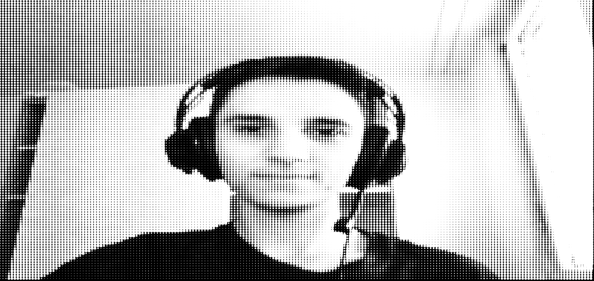

# Day 06 Elp

## Faces

The only idea that i had, was to convert your webcam video into dots. The dots should get bigger the brighter a pixel is and smaller the darker the pixel is. If the webcam doesnt work in this frame, then the problem is, that it doesnt use the correct output. If you open the console, there should be an array full of the possible inputs. At whatever index your webcam is, you have to insert this number into the setup. If it doesnt work there is a Screenshot below to see what it should look like.


<iframe src="content/day06/1/index.html" width="100%" height="450" frameborder="no"></iframe>


[Animated](content/day06/1/index.html)

